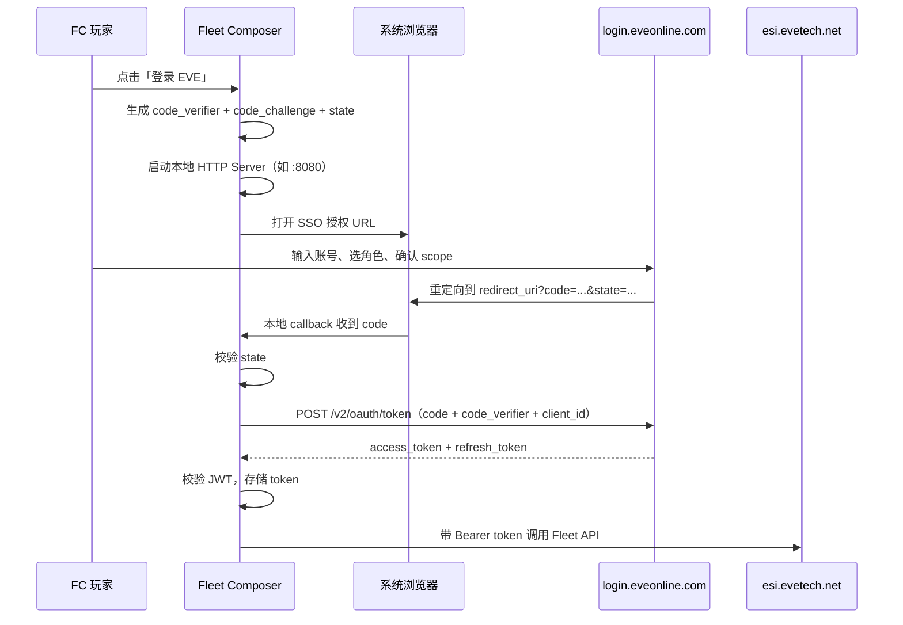

# EVE Online 舰队管理系统 — 程序设计文档

> **文档版本**: 1.0  
> **最后更新**: 2026-06-10  
> **状态**: 已对齐，可开始开发  
> **目标读者**: 任意接手的程序员，无需额外背景即可开工

---

## 目录

1. [项目概述](#1-项目概述)
2. [可行性结论（已确认）](#2-可行性结论已确认)
3. [硬性限制与业务假设](#3-硬性限制与业务假设)
4. [系统架构](#4-系统架构)
5. [EVE SSO 与授权设计](#5-eve-sso-与授权设计)
6. [ESI Fleet API 完整规格](#6-esi-fleet-api-完整规格)
7. [速率限制与 Token 预算](#7-速率限制与-token-预算)
8. [数据模型](#8-数据模型)
9. [核心业务流程](#9-核心业务流程)
10. [UI/UX 设计要求](#10-uiux-设计要求)
11. [错误处理与边界情况](#11-错误处理与边界情况)
12. [项目目录结构（建议）](#12-项目目录结构建议)
13. [技术栈与依赖](#13-技术栈与依赖)
14. [开发阶段划分（MVP → 完整版）](#14-开发阶段划分mvp--完整版)
15. [配置与环境变量](#15-配置与环境变量)
16. [安全要求（强制）](#16-安全要求强制)
17. [参考链接](#17-参考链接)
18. [开发检查清单](#18-开发检查清单)

---

## 1. 项目概述

### 1.1 项目名称

**Fleet Composer**（工作名，可调整）

### 1.2 项目目标

开发一个基于 **Python 的桌面应用程序**，供 EVE Online 舰队指挥官（FC）使用，实现：

1. **可视化舰队编排**：拖拽角色到联队（Wing）/中队（Squad）的指定位置
2. **战术角色标注**：在软件内标记 DPS、Logistics、FC、Interceptor 等（仅本地元数据）
3. **舰队职位指定**：指定 Fleet Commander、Wing Commander、Squad Commander、Squad Member
4. **MOTD 编辑**：在软件内编写舰队 MOTD，部署时写入游戏
5. **ESI 一键部署**：通过官方 API 连接游戏，批量创建联队/中队结构、设置 MOTD、批量发送邀请
6. **模板管理**：保存/加载舰队构成模板（JSON 文件）

### 1.3 非目标（明确不做）

- 不能通过 API **创建舰队**（ESI 不支持，必须在游戏内手动创建）
- 不能让被邀请玩家自动加入舰队（API 只发邀请，玩家需在游戏内接受）
- 不能通过 API 传递 DPS/Logi 等战术角色给游戏（API 只认舰队职位）
- 第一期不做 Web 版（避免需要后端服务器保管 Client Secret）
- 第一期不做多账号/多角色同时管理

### 1.4 目标用户

- 军团/联盟 FC
- 需要频繁组织集结、希望提前编排舰队结构并批量邀请的人

### 1.5 应用类型

| 属性 | 值 |
|------|-----|
| 平台 | 桌面应用（Windows / macOS / Linux） |
| 语言 | Python 3.11+ |
| UI 框架 | PySide6 或 PyQt6（推荐 PySide6，LGPL 许可） |
| 授权方式 | EVE SSO + PKCE（桌面原生应用标准流程） |
| 是否需要自有服务器 | **否** |

---

## 2. 可行性结论（已确认）

| 功能 | 可行性 | 说明 |
|------|--------|------|
| Python 可视化舰队编排（拖拽、模板） | ✅ 完全可行 | 纯本地，与 API 无关 |
| 设置 MOTD、自由移动 | ✅ 可行 | `PUT /fleets/{fleet_id}/` |
| 创建联队/中队结构 | ✅ 可行 | `POST .../wings/`、`POST .../squads/` |
| 批量邀请 + 指定职位 | ✅ 可行 | `POST /fleets/{fleet_id}/members/` |
| 移动已加入成员 | ✅ 可行 | `PUT .../members/{member_id}/` |
| **一键创建舰队** | ❌ **不可行** | ESI 没有创建舰队的接口 |
| 被邀请者无需登录本软件 | ✅ | 他们在游戏内收邀请即可 |
| DPS/后勤等战术角色同步到游戏 | ⚠️ 仅本地 | API 只认舰队职位，不认船型/职责 |
| 200–300 人批量邀请 | ✅ 速率限制内安全 | 见第 7 章 Token 预算 |
| 500 人批量邀请 | ✅ 一般安全 | 建议加请求队列 |
| 900+ 人一次性爆发邀请 | ❌ 会触发 429 | 需分批 + 等待 token 恢复 |

**结论：项目值得做，但「完全一键从零建队」做不到；现实工作流是「游戏内建队 → 软件接管后续」。**

---

## 3. 硬性限制与业务假设

### 3.1 ESI 硬性限制

1. **无法 API 创建舰队**  
   CCP 官方开发者在论坛明确：ESI 可以邀请成员、管理联队/中队，但不能直接创建舰队。  
   参考：https://forums.eveonline.com/t/can-esi-create-a-fleet/234544

2. **邀请 ≠ 自动加入**  
   `POST /fleets/{fleet_id}/members/` 返回 204 仅表示邀请已发送，玩家必须在游戏客户端接受。

3. **CSPA 收费角色无法 ESI 邀请**  
   若目标角色设置了 CSPA 邀请费，ESI 邀请会失败，只能游戏内手动邀请。

4. **操作者必须有舰队管理权限**  
   OAuth Token 绑定的角色必须是舰队 Boss 或具有相应管理权限的角色。

5. **舰队职位只有四种**（API 层面）  
   - `fleet_commander`
   - `wing_commander`
   - `squad_commander`
   - `squad_member`

6. **战术角色（DPS/Logi/ECM 等）是软件本地概念**  
   用于 UI 展示、颜色标记、筛选、备注，不传给 ESI。

### 3.2 职位与 wing_id / squad_id 的规则（API 强制）

| role | wing_id | squad_id |
|------|---------|----------|
| `fleet_commander` | **不得指定** | **不得指定** |
| `wing_commander` | **必须指定** | **不得指定** |
| `squad_commander` | **必须指定** | **必须指定** |
| `squad_member` | 可指定或都不指定 | 与 wing_id 同规则：都指定或都不指定 |

若 `squad_member` 不指定 wing/squad，被邀请者会加入任意有空位的中队。

违反规则会返回 **422**（例如 `missing wing_id`）。

### 3.3 业务假设

- FC 在点击「部署」前已在游戏内创建舰队并成为 Boss
- 一次部署操作由一个 FC 角色完成（单 Token）
- 舰队模板中的角色名可通过公开 API 解析为 `character_id`
- 被邀请的玩家不需要安装或登录本软件

---

## 4. 系统架构

### 4.1 高层架构图

```
┌─────────────────────────────────────────────────────────────────┐
│                    Fleet Composer（桌面应用）                     │
├─────────────────────────────────────────────────────────────────┤
│  Presentation Layer（UI）                                          │
│  ├─ FleetDesignerView      拖拽编排、联队/中队树形结构               │
│  ├─ MotdEditor             MOTD 编辑（支持 CCP HTML 预览）          │
│  ├─ CharacterPalette       角色列表（手动输入 / 军团导入）           │
│  ├─ DeployPanel            部署控制、进度、错误报告                 │
│  └─ LoginDialog              EVE SSO 登录                          │
├─────────────────────────────────────────────────────────────────┤
│  Application Layer                                               │
│  ├─ FleetTemplateService   模板 CRUD（本地 JSON）                   │
│  ├─ DeployOrchestrator     部署编排（建队结构 → MOTD → 邀请队列）    │
│  └─ InviteQueue            限速邀请队列                            │
├─────────────────────────────────────────────────────────────────┤
│  Infrastructure Layer                                            │
│  ├─ EveSsoClient           PKCE 登录、Token 刷新、JWT 校验         │
│  ├─ EveEsiClient           ESI HTTP 封装、响应头监控               │
│  ├─ CharacterResolver      POST /universe/ids/ 角色名解析         │
│  └─ TokenStore             本地加密存储 refresh_token              │
└─────────────────────────────────────────────────────────────────┘
         │                                    │
         ▼                                    ▼
  login.eveonline.com                  esi.evetech.net
  （仅 FC 登录授权）                    （舰队读写 API）
```

### 4.2 模块职责

| 模块 | 职责 |
|------|------|
| `EveSsoClient` | 生成 PKCE challenge、打开浏览器、本地 callback 服务、换 token、刷新 token |
| `EveEsiClient` | 封装 Fleet ESI 调用，统一注入 Bearer token，解析 rate limit 响应头 |
| `CharacterResolver` | 批量将角色名转为 character_id（公开 API，无需授权） |
| `FleetTemplateService` | 舰队模板的保存、加载、校验 |
| `DeployOrchestrator` | 按顺序执行：检测舰队 → 建结构 → 设 MOTD → 批量邀请 |
| `InviteQueue` | 带间隔的邀请队列，监控 `X-Ratelimit-Remaining`，处理 429 |
| `TokenStore` | 本地持久化 token（加密存储 refresh_token） |

### 4.3 与 Pyfa 的关系

本仓库当前是 **Pyfa** 项目。Fleet Composer 是**独立新应用**，可参考 Pyfa 的 `service/esiAccess.py` 中 PKCE 实现，但应在新目录独立开发，不修改 Pyfa 现有功能。

---

## 5. EVE SSO 与授权设计

### 5.1 谁需要登录？

| 用户类型 | 是否需要登录本软件 |
|----------|------------------|
| FC / 舰队管理者 | ✅ **必须** |
| 被邀请的普通成员 | ❌ 不需要 |
| 仅做舰队编排、不连 API 的用户 | ❌ 不需要（可离线使用） |

### 5.2 授权流程（PKCE，桌面应用标准）



### 5.3 SSO 应用注册信息（已创建）

| 配置项 | 值 |
|--------|-----|
| 注册地址 | https://developers.eveonline.com/applications/create |
| Connection Type | Authentication & API Access |
| Callback URL（开发阶段） | `http://localhost:8080/callback/` |
| 授权流程 | **PKCE**（桌面应用，不使用 Client Secret） |

> ⚠️ **Client ID 和 Client Secret 通过环境变量配置，禁止写入代码仓库。**  
> 见第 15 章 `.env` 配置。  
> 桌面 PKCE 流程**只需要 Client ID**，Client Secret 不需要放入客户端。

### 5.4 已申请的 Scope（MVP）

```
esi-fleets.read_fleet.v1
esi-fleets.write_fleet.v1
```

### 5.5 第二阶段可选 Scope

```
esi-corporations.read_corporation_membership.v1
```

用途：`GET /corporations/{corporation_id}/members/` 导入军团成员列表。  
MVP 阶段可不申请；若后续添加此 scope，所有用户需重新授权。

### 5.6 Token 生命周期

| Token | 有效期 | 存储 | 用途 |
|-------|--------|------|------|
| authorization_code | 5 分钟，一次性 | 不存储 | 换取 access_token |
| access_token | ~20 分钟 | 内存 + 可选本地缓存 | ESI 请求 Bearer 头 |
| refresh_token | 长期（直到用户撤销） | **本地加密存储** | 刷新 access_token |

### 5.7 SSO 端点（动态获取，可缓存）

```
GET https://login.eveonline.com/.well-known/oauth-authorization-server
```

从中读取：
- `authorization_endpoint` → 授权页
- `token_endpoint` → 换 token
- `jwks_uri` → JWT 签名校验

### 5.8 授权 URL 构造参数

```
GET https://login.eveonline.com/v2/oauth/authorize?
  response_type=code
  &client_id={CLIENT_ID}
  &redirect_uri={URL_ENCODED_CALLBACK}
  &scope=esi-fleets.read_fleet.v1 esi-fleets.write_fleet.v1
  &state={RANDOM_STATE}
  &code_challenge={SHA256_BASE64URL_OF_VERIFIER}
  &code_challenge_method=S256
```

### 5.9 Token 交换请求

```
POST https://login.eveonline.com/v2/oauth/token
Content-Type: application/x-www-form-urlencoded

grant_type=authorization_code
&code={AUTHORIZATION_CODE}
&client_id={CLIENT_ID}
&code_verifier={CODE_VERIFIER}
```

刷新 Token：

```
POST https://login.eveonline.com/v2/oauth/token
Content-Type: application/x-www-form-urlencoded

grant_type=refresh_token
&refresh_token={REFRESH_TOKEN}
&client_id={CLIENT_ID}
```

### 5.10 JWT 校验要求

校验 access_token（JWT）时须验证：
- 签名（从 JWKS 获取公钥）
- `exp` 未过期
- `iss` 为 `login.eveonline.com` 或 `https://login.eveonline.com/`
- `aud` 包含 `"EVE Online"` 和你的 `client_id`
- 从 `sub` 提取 character_id（格式：`CHARACTER:EVE:{id}`）
- 从 `name` 获取角色名
- 从 `scp` 获取已授权 scope 列表

### 5.11 本地 Callback Server 规范

- 监听地址：`127.0.0.1` 或 `localhost`
- 端口：`8080`（可配置，默认 8080）
- 路径：`/callback/`
- 收到 `code` 和 `state` 后：
  1. 校验 `state`
  2. 返回一个简单的 HTML 页面告知用户「登录成功，可关闭此页面」
  3. 关闭 HTTP Server
  4. 用 `code` 换 token
- 若 5 分钟内未完成，code 过期，需重新登录

### 5.12 正式发布时的 Callback URL 方案

开发阶段使用 `http://localhost:8080/callback/`。  
正式发布时不应继续使用 localhost（官方建议）。可选方案：

1. **GitHub Pages 静态回调页**（参考 Pyfa：`https://pyfa-org.github.io/Pyfa/callback`）
2. **自定义协议**：`eveauth-fleetcomposer://callback/`（须在开发者门户注册，且以 `eveauth` 开头）

两种方案均可在开发者门户添加为额外 Callback URL，开发与生产可并存。

---

## 6. ESI Fleet API 完整规格

**Base URL**: `https://esi.evetech.net/latest`  
**认证**: 所有 Fleet 接口均需 `Authorization: Bearer {access_token}`

### 6.1 接口一览

| 方法 | 路径 | 说明 | Scope | 缓存 |
|------|------|------|-------|------|
| GET | `/characters/{character_id}/fleet/` | 获取角色当前舰队 ID | read | 60s |
| GET | `/fleets/{fleet_id}/` | 获取舰队信息（MOTD 等） | read | 5s |
| PUT | `/fleets/{fleet_id}/` | 更新舰队设置 | write | - |
| GET | `/fleets/{fleet_id}/members/` | 获取成员列表 | read | 5s |
| POST | `/fleets/{fleet_id}/members/` | 发送邀请 | write | - |
| PUT | `/fleets/{fleet_id}/members/{member_id}/` | 移动成员 | write | - |
| DELETE | `/fleets/{fleet_id}/members/{member_id}/` | 踢出成员 | write | - |
| GET | `/fleets/{fleet_id}/wings/` | 获取联队结构 | read | 5s |
| POST | `/fleets/{fleet_id}/wings/` | 创建联队 | write | - |
| PUT | `/fleets/{fleet_id}/wings/{wing_id}/` | 重命名联队 | write | - |
| DELETE | `/fleets/{fleet_id}/wings/{wing_id}/` | 删除联队 | write | - |
| POST | `/fleets/{fleet_id}/wings/{wing_id}/squads/` | 创建中队 | write | - |
| PUT | `/fleets/{fleet_id}/squads/{squad_id}/` | 重命名中队 | write | - |
| DELETE | `/fleets/{fleet_id}/squads/{squad_id}/` | 删除中队 | write | - |

### 6.2 GET /characters/{character_id}/fleet/

**用途**：检测 FC 是否已在舰队中，获取 `fleet_id`。

响应示例：
```json
{
  "fleet_id": 123456789
}
```

若角色不在舰队中，返回 404。

### 6.3 GET /fleets/{fleet_id}/

响应示例：
```json
{
  "is_free_move": false,
  "is_registered": false,
  "is_voice_enabled": false,
  "motd": "This is an <b>awesome</b> fleet!"
}
```

### 6.4 PUT /fleets/{fleet_id}/

请求体：
```json
{
  "motd": "集结点：<b>Jita 4-4</b>，带 MWD",
  "is_free_move": false
}
```

- `motd`：CCP 风格 HTML（支持 `<b>` 等标签）
- `is_free_move`：是否允许自由移动
- 成功返回 **204**

> 注意：当前 OpenAPI 规范中 PUT 请求体只有 `motd` 和 `is_free_move`，不含 `is_voice_enabled`。

### 6.5 POST /fleets/{fleet_id}/members/（邀请）

请求体：
```json
{
  "character_id": 123456789,
  "role": "squad_member",
  "wing_id": 1,
  "squad_id": 1
}
```

- `character_id`（必填）：被邀请角色 ID
- `role`（必填）：`fleet_commander` | `wing_commander` | `squad_commander` | `squad_member`
- `wing_id`（可选）：联队 ID
- `squad_id`（可选）：中队 ID
- 成功返回 **204**

错误码：
| 状态码 | 含义 |
|--------|------|
| 400 | 请求格式错误 |
| 401 | Token 无效/过期 |
| 403 | 无权限 |
| 404 | 舰队不存在或无权访问 |
| 420 | 错误限速（全局） |
| 422 | 邀请参数错误（如缺少 wing_id） |
| 429 | 速率限制 |

### 6.6 POST /fleets/{fleet_id}/wings/

创建联队，成功返回 201，响应体含新 `wing_id`。

### 6.7 POST /fleets/{fleet_id}/wings/{wing_id}/squads/

创建中队，成功返回 201，响应体含新 `squad_id`。

### 6.8 角色名解析（公开 API，无需授权）

```
POST https://esi.evetech.net/latest/universe/ids/
Content-Type: application/json

["Character Name 1", "Character Name 2"]
```

响应：
```json
{
  "characters": [
    {"id": 123, "name": "Character Name 1"},
    {"id": 456, "name": "Character Name 2"}
  ]
}
```

未找到的名称不会出现在结果中。  
此接口**不属于 fleet 速率限制组**。

### 6.9 军团成员列表（第二阶段，需 scope）

```
GET /corporations/{corporation_id}/members/
Scope: esi-corporations.read_corporation_membership.v1
```

速率限制组：`corp-member`（300 token / 15 分钟），与 fleet 组独立。

### 6.10 HTTP 请求通用要求

所有 ESI 请求必须包含：
```
User-Agent: FleetComposer/1.0.0 (contact@your-email.com)
Accept: application/json
Authorization: Bearer {access_token}   # 认证接口
```

---

## 7. 速率限制与 Token 预算

### 7.1 Fleet 速率限制组

| 参数 | 值 |
|------|-----|
| 组名 | `fleet` |
| 窗口 | 900 秒（15 分钟），浮动窗口 |
| 桶容量 | **1800 token** |
| 作用域 | `应用 Client ID` + `登录角色 ID` 共享一个桶 |
| 覆盖范围 | 所有 Fleet 相关接口 |

### 7.2 单次请求 Token 消耗

| 响应类型 | 状态码 | Token 消耗 |
|----------|--------|-----------|
| 成功 | 2XX | **2** |
| 缓存/未修改 | 3XX | **1** |
| 客户端错误 | 4XX | **5** ⚠️ |
| 服务端错误 | 5XX | **0** |
| 速率限制 | 429 | 不计入 error limit |

**关键：操作类型不影响消耗，成功邀请 = 成功读舰队 = 2 token。**

### 7.3 典型部署场景 Token 估算

假设：读舰队(3次) + 建结构(12次) + MOTD(1次) + 邀请 N 人

**总 Token ≈ 62 + 2N**

| 舰队人数 N | 总 Token | 占 1800 比例 | 结论 |
|-----------|---------|-------------|------|
| 50 | ~162 | 9% | ✅ 非常安全 |
| 100 | ~262 | 15% | ✅ 安全 |
| 200 | ~462 | 26% | ✅ 安全 |
| 300 | ~662 | 37% | ✅ 安全 |
| 500 | ~1062 | 59% | ✅ 建议加队列 |
| 800 | ~1662 | 92% | ⚠️ 接近上限 |
| 900+ | ~1800+ | 100%+ | ❌ 会 429 |

纯邀请理论上限：**约 900 次成功请求 / 15 分钟**。

### 7.4 真正需要警惕的场景

#### A. 突发请求（Burst）

桶容量 1800，若数秒内发出 900+ 次成功请求会立刻 429。  
**对策**：邀请队列间隔 300–500ms，或根据 `X-Ratelimit-Remaining` 自适应降速。

#### B. 失败请求更耗 Token

100 次 CSPA/422 失败 = 500 token（成功只需 200 token）。  
**对策**：邀请前用 `/universe/ids/` 校验角色名，失败的不重试。

#### C. 全局错误限速（420）— 比 fleet token 更危险

- 1 分钟内超过 **100 次非 2XX/3XX 响应** → 接下来整分钟**所有 ESI 接口**返回 420
- 与 fleet 桶独立
- **对策**：预校验 character_id；同一错误不重复请求；监控 `X-ESI-Error-Limit-Remain`

#### D. 成员状态轮询

| 轮询频率 | 15 分钟消耗（仅 GET members） |
|----------|------------------------------|
| 每 5 秒 | ~360 token ✅ |
| 每 2 秒 | ~900 token ⚠️ |
| 每 1 秒 | ~1800 token ❌ |

`GET members` 缓存 5 秒，**不应高于每 5 秒一次**。

### 7.5 需监控的响应头

| 响应头 | 含义 |
|--------|------|
| `X-Ratelimit-Limit` | 桶配置，如 `1800/15m` |
| `X-Ratelimit-Remaining` | 剩余 token |
| `X-Ratelimit-Used` | 本次消耗 |
| `Retry-After` | 429 时等待秒数 |
| `X-ESI-Error-Limit-Remain` | 全局错误剩余次数 |
| `X-ESI-Error-Limit-Reset` | 错误窗口重置秒数 |

### 7.6 邀请队列算法（必须实现）

```python
# 伪代码
QUEUE_INTERVAL_MS = 400          # 默认间隔
MIN_REMAINING_THRESHOLD = 100    # 剩余低于此值时降速

for invite in pending_invites:
    remaining = last_response_headers.get("X-Ratelimit-Remaining")
    if remaining is not None and int(remaining) < MIN_REMAINING_THRESHOLD:
        sleep(1.0)  # 降速
    else:
        sleep(QUEUE_INTERVAL_MS / 1000)

    response = post_invite(invite)

    if response.status == 429:
        retry_after = int(response.headers.get("Retry-After", 60))
        sleep(retry_after)
        retry(invite)  # 最多重试 1 次
    elif response.status == 204:
        mark_success(invite)
    elif response.status == 422:
        mark_failed(invite, reason=response.body.error)  # 不重试
    else:
        mark_failed(invite, reason=f"HTTP {response.status}")
```

---

## 8. 数据模型

### 8.1 舰队模板（FleetTemplate）

本地 JSON 文件，是编排器的核心数据结构。

```json
{
  "schema_version": 1,
  "name": "周三集结 - 甲队",
  "created_at": "2026-06-10T12:00:00Z",
  "updated_at": "2026-06-10T12:00:00Z",
  "motd": "集结点：<b>JU-UY6</b>，甲队 MWD，带抗",
  "is_free_move": false,
  "wings": [
    {
      "local_id": "wing-1",
      "name": "Alpha Wing",
      "squads": [
        {
          "local_id": "squad-1-1",
          "name": "DPS Squad 1",
          "members": [
            {
              "character_name": "Player One",
              "character_id": null,
              "fleet_role": "squad_commander",
              "tactical_role": "fc_backup",
              "notes": ""
            },
            {
              "character_name": "Player Two",
              "character_id": null,
              "fleet_role": "squad_member",
              "tactical_role": "dps",
              "notes": "Machariel"
            }
          ]
        }
      ],
      "wing_commander": {
        "character_name": "Wing Boss",
        "character_id": null,
        "fleet_role": "wing_commander",
        "tactical_role": "logistics",
        "notes": ""
      }
    }
  ],
  "fleet_commander": {
    "character_name": "FC Main",
    "character_id": null,
    "fleet_role": "fleet_commander",
    "tactical_role": "fc",
    "notes": ""
  }
}
```

### 8.2 字段说明

#### FleetTemplate

| 字段 | 类型 | 说明 |
|------|------|------|
| `schema_version` | int | 模板格式版本，便于迁移 |
| `name` | string | 模板名称 |
| `motd` | string | 部署时写入游戏的 MOTD |
| `is_free_move` | bool | 部署时写入游戏的自由移动设置 |
| `wings` | Wing[] | 联队列表 |
| `fleet_commander` | Member | 舰队指挥官（可选，通常即登录 FC） |

#### Wing

| 字段 | 类型 | 说明 |
|------|------|------|
| `local_id` | string | 本地唯一 ID，用于映射 API 返回的 wing_id |
| `name` | string | 联队显示名 |
| `squads` | Squad[] | 中队列表 |
| `wing_commander` | Member? | 联队长 |

#### Squad

| 字段 | 类型 | 说明 |
|------|------|------|
| `local_id` | string | 本地唯一 ID，用于映射 API 返回的 squad_id |
| `name` | string | 中队显示名 |
| `members` | Member[] | 中队成员 |

#### Member

| 字段 | 类型 | 说明 |
|------|------|------|
| `character_name` | string | 角色名（必填） |
| `character_id` | int? | 解析后的 ID，部署前填充 |
| `fleet_role` | enum | API 职位：`fleet_commander` / `wing_commander` / `squad_commander` / `squad_member` |
| `tactical_role` | enum | 本地战术标签，见下表 |
| `notes` | string | 自由备注（如船型） |

#### tactical_role 枚举（仅本地，不传给 API）

```
fc, fc_backup, dps, logistics, ecm, interdictor, tackle, scout, cyno, other
```

### 8.3 部署状态（DeploySession）

运行时内存结构，不持久化。

```python
@dataclass
class DeploySession:
    fleet_id: int | None
    status: Literal["idle", "resolving", "creating_structure", "setting_motd", "inviting", "done", "error"]
    wing_id_map: dict[str, int]      # local_id -> API wing_id
    squad_id_map: dict[str, int]    # local_id -> API squad_id
    invite_results: list[InviteResult]
    tokens_used: int
    started_at: datetime
    finished_at: datetime | None

@dataclass
class InviteResult:
    character_name: str
    character_id: int
    fleet_role: str
    wing_id: int | None
    squad_id: int | None
    status: Literal["pending", "success", "failed", "skipped"]
    error_message: str | None
    http_status: int | None
```

### 8.4 本地 ID → API ID 映射

创建联队/中队时，API 返回的 `wing_id` / `squad_id` 是游戏分配的整数。  
部署时必须维护映射：

```
template.wings[0].local_id  "wing-1"  →  API wing_id 1
template.wings[0].squads[0].local_id  "squad-1-1"  →  API squad_id 1
```

邀请时使用映射后的 ID。

---

## 9. 核心业务流程

### 9.1 用户主流程

```
1. 启动应用
2. [可选] 加载已有舰队模板 / 新建模板
3. 在可视化编辑器中编排舰队（拖拽角色、设置职位、写 MOTD）
4. 保存模板
5. 点击「登录 EVE」→ FC 角色授权
6. FC 在游戏内手动创建舰队（应用显示提示）
7. 点击「检测舰队」→ GET /characters/{id}/fleet/
8. 点击「部署」→ 执行 DeployOrchestrator
9. 查看部署报告（成功/失败列表）
```

### 9.2 部署编排器（DeployOrchestrator）步骤

```
步骤 0: 预检
  ├─ 确认已登录，access_token 有效（过期则 refresh）
  ├─ 确认所有 character_name 已解析为 character_id
  └─ 确认 FC 角色在舰队中（GET /characters/{id}/fleet/）

步骤 1: 解析角色名（若尚未解析）
  └─ POST /universe/ids/ 批量解析
  └─ 标记无法解析的角色为 skipped

步骤 2: 创建舰队结构
  ├─ GET /fleets/{id}/wings/ 获取现有结构（避免重复创建）
  ├─ 对每个模板 Wing: POST /fleets/{id}/wings/
  ├─ 记录 local_id → wing_id 映射
  ├─ 对每个模板 Squad: POST /fleets/{id}/wings/{wing_id}/squads/
  └─ 记录 local_id → squad_id 映射

步骤 3: 设置 MOTD
  └─ PUT /fleets/{id}/  { motd, is_free_move }

步骤 4: 批量邀请（通过 InviteQueue）
  ├─ 按顺序：fleet_commander → wing_commander → squad_commander → squad_member
  ├─ 对每个 Member: POST /fleets/{id}/members/
  └─ 记录 InviteResult

步骤 5: 生成部署报告
  └─ 展示成功数、失败数、失败原因
```

### 9.3 邀请顺序说明

建议先邀请指挥官角色，再邀请普通成员。  
这不是 API 强制要求，但有助于舰队结构在游戏内正确建立。

### 9.4 「检测舰队」流程

```python
def detect_fleet(character_id: int, token: str) -> int | None:
    response = GET(f"/characters/{character_id}/fleet/", token=token)
    if response.status == 200:
        return response.json["fleet_id"]
    if response.status == 404:
        return None  # 不在舰队中
    raise FleetApiError(response)
```

UI 应显示：
- 在舰队中 → 显示 fleet_id，「部署」按钮可用
- 不在舰队中 → 提示「请先在游戏内创建舰队」

---

## 10. UI/UX 设计要求

### 10.1 主界面布局

```
┌──────────────────────────────────────────────────────────────────┐
│  菜单栏: 文件 | 编辑 | 登录 | 帮助                                   │
├──────────────┬───────────────────────────────────┬───────────────┤
│  角色面板     │  舰队结构编辑器（主区域）              │  属性面板      │
│              │                                   │               │
│  [搜索/添加]  │  ┌─ Fleet Commander: FC Main ─┐  │  选中成员属性   │
│              │  │                             │  │  - 角色名      │
│  待分配角色:  │  ├─ Wing: Alpha ─────────────┤  │  - 舰队职位     │
│  - Player A  │  │  Wing Cmd: Wing Boss      │  │  - 战术角色     │
│  - Player B  │  │  ├─ Squad: DPS 1          │  │  - 备注        │
│  - Player C  │  │  │  Cmd: Player One       │  │               │
│              │  │  │  - Player Two (DPS)    │  │  MOTD 编辑区   │
│  [军团导入]   │  │  │  - Player Three (DPS)  │  │  [富文本/预览]  │
│  (Phase 2)   │  │  └─ Squad: Logi 1         │  │               │
│              │  └─────────────────────────────┘  │  [✓]自由移动   │
├──────────────┴───────────────────────────────────┴───────────────┤
│  状态栏: 登录角色 | 舰队状态 | Token 剩余 | 部署进度                  │
└──────────────────────────────────────────────────────────────────┘
```

### 10.2 关键交互

| 交互 | 行为 |
|------|------|
| 拖拽角色到中队 | 设置 `fleet_role=squad_member`，加入该 squad.members |
| 拖拽角色到联队标题 | 设置 `fleet_role=wing_commander` |
| 拖拽角色到舰队标题 | 设置 `fleet_role=fleet_commander` |
| 右键成员 | 设置战术角色、舰队职位、删除、编辑备注 |
| 双击角色面板中的名字 | 快速添加到当前选中中队 |
| 保存模板 | 写入 `~/.fleet-composer/templates/{name}.json` |
| 部署 | 打开 DeployPanel 显示进度条和实时日志 |

### 10.3 部署面板

```
┌─ 部署进度 ─────────────────────────────────────┐
│  [████████░░░░░░░░] 45/100 邀请                │
│                                                │
│  ✅ MOTD 已设置                                 │
│  ✅ 创建了 3 个联队、9 个中队                      │
│  ⏳ 正在邀请 Player XYZ...                      │
│                                                │
│  失败 (2):                                      │
│  ❌ Player A - CSPA charge set (无法 ESI 邀请)  │
│  ❌ Player B - Character not found              │
│                                                │
│  [取消]  [导出报告]                              │
└────────────────────────────────────────────────┘
```

### 10.4 战术角色颜色（建议）

| tactical_role | 颜色 |
|---------------|------|
| fc | 金色 |
| dps | 红色 |
| logistics | 绿色 |
| ecm | 蓝色 |
| interdictor | 橙色 |
| tackle | 黄色 |
| other | 灰色 |

---

## 11. 错误处理与边界情况

### 11.1 错误分类与用户提示

| 错误 | HTTP | 用户提示 | 是否重试 |
|------|------|---------|---------|
| 角色名无法解析 | - | 「角色名不存在: {name}」 | 否 |
| 不在舰队中 | 404 | 「请先在游戏内创建舰队」 | 否 |
| Token 过期 | 401 | 自动 refresh，失败则提示重新登录 | refresh 一次 |
| 无权限 | 403 | 「当前角色无舰队管理权限」 | 否 |
| CSPA 限制 | 422/其他 | 「{name} 设置了 CSPA，请手动邀请」 | 否 |
| 邀请参数错误 | 422 | 「{name}: {error_message}」 | 否 |
| 速率限制 | 429 | 自动等待 Retry-After 后重试 | 是，最多 1 次 |
| 全局错误限制 | 420 | 「请求过于频繁，请等待 {n} 秒后重试」 | 等待后重试 |
| 网络错误 | - | 「网络连接失败」 | 是，最多 3 次 |

### 11.2 CSPA 检测

ESI 文档说明：若角色设置了 CSPA charge，无法通过 ESI 邀请。  
API 不一定返回明确的 "CSPA" 字符串，实现时将所有 422 邀请失败统一记录并在 UI 提示「可能需要手动邀请」。

### 11.3 重复部署

若对同一舰队重复部署：
- 创建联队/中队前应先 `GET wings` 检查现有结构
- MVP 可简单处理：提示「舰队中已有结构，是否继续？可能导致重复联队」
- 完整版：diff 现有结构与模板，仅创建缺少的部分

### 11.4 角色不在线

ESI 邀请不要求角色在线，邀请会发送到游戏内。  
若 API 返回错误，按错误码处理，不要假设「不在线」。

---

## 12. 项目目录结构（建议）

在仓库中新建独立目录（不要污染 Pyfa 主代码）：

```
fleet-composer/
├── README.md
├── pyproject.toml              # 或 requirements.txt
├── .env.example                # 环境变量模板（不含真实密钥）
├── .gitignore
│
├── fleet_composer/
│   ├── __init__.py
│   ├── __main__.py             # python -m fleet_composer
│   ├── app.py                  # 应用入口
│   │
│   ├── config.py               # 配置加载（从环境变量）
│   │
│   ├── auth/
│   │   ├── __init__.py
│   │   ├── sso_client.py       # PKCE 登录、token 刷新
│   │   ├── callback_server.py  # 本地 HTTP callback
│   │   └── token_store.py      # 加密存储 refresh_token
│   │
│   ├── esi/
│   │   ├── __init__.py
│   │   ├── client.py           # ESI HTTP 基类
│   │   ├── fleet_api.py        # Fleet 端点封装
│   │   └── universe_api.py     # /universe/ids/ 等公开接口
│   │
│   ├── models/
│   │   ├── __init__.py
│   │   ├── template.py         # FleetTemplate 数据类
│   │   └── deploy.py           # DeploySession, InviteResult
│   │
│   ├── services/
│   │   ├── __init__.py
│   │   ├── template_service.py # 模板 CRUD
│   │   ├── resolver.py         # 角色名解析
│   │   ├── deploy_orchestrator.py
│   │   └── invite_queue.py
│   │
│   └── ui/
│       ├── __init__.py
│       ├── main_window.py
│       ├── fleet_designer.py
│       ├── motd_editor.py
│       ├── character_palette.py
│       ├── deploy_panel.py
│       └── login_dialog.py
│
├── templates/                  # 示例模板
│   └── example-fleet.json
│
└── tests/
    ├── test_template.py
    ├── test_resolver.py
    ├── test_invite_queue.py
    └── test_deploy_orchestrator.py
```

---

## 13. 技术栈与依赖

### 13.1 核心依赖

```
Python >= 3.11
PySide6 >= 6.6          # UI
httpx >= 0.27           # HTTP 客户端（或 requests）
python-jose[cryptography]  # JWT 校验
cryptography            # refresh_token 本地加密
pydantic >= 2.0         # 数据模型校验（推荐）
python-dotenv           # .env 加载
```

### 13.2 开发依赖

```
pytest
pytest-qt               # UI 测试
ruff                    # lint
```

### 13.3 参考实现

Pyfa 项目中可参考的文件（只读参考，不直接依赖）：
- `service/esiAccess.py` — PKCE SSO 实现
- `config.py` — SSO 端点配置结构

EVE 官方 Python SSO 示例：
- https://github.com/esi/esi-docs/blob/master/examples/python/sso/esi_oauth_native.py

---

## 14. 开发阶段划分（MVP → 完整版）

### Phase 1 — MVP（必须先完成）

- [ ] 项目脚手架 + 配置加载
- [ ] PKCE SSO 登录（本地 callback）
- [ ] Token 存储与自动刷新
- [ ] `GET /characters/{id}/fleet/` 检测舰队
- [ ] 舰队模板 JSON 读写
- [ ] 基础 UI：联队/中队树形结构 + 手动添加角色
- [ ] MOTD 编辑
- [ ] `POST /universe/ids/` 角色名解析
- [ ] 部署编排器：建联队/中队 → 设 MOTD → 批量邀请
- [ ] 邀请队列（400ms 间隔 + 429 处理）
- [ ] 部署结果报告

### Phase 2 — 体验增强

- [ ] 拖拽编排 UI
- [ ] 战术角色颜色标记
- [ ] 模板列表管理（新建/复制/删除）
- [ ] 部署前预检面板（显示无法解析的角色、CSPA 风险提示）
- [ ] `GET /fleets/{id}/members/` 邀请状态轮询（每 5 秒）
- [ ] 响应头 rate limit 显示在状态栏

### Phase 3 — 高级功能

- [ ] 军团成员导入（`esi-corporations.read_corporation_membership.v1`）
- [ ] 重复部署时结构 diff（避免重复创建联队）
- [ ] 移动已加入成员（`PUT members/{id}`）
- [ ] 部署报告导出（CSV/JSON）
- [ ] 正式发布 Callback URL（GitHub Pages 或自定义协议）

---

## 15. 配置与环境变量

### 15.1 .env 文件（本地，不提交 Git）

```bash
# EVE SSO
EVE_CLIENT_ID=your_client_id_here
EVE_CALLBACK_URL=http://localhost:8080/callback/
EVE_CALLBACK_PORT=8080

# EVE SSO Scopes（空格分隔）
EVE_SCOPES=esi-fleets.read_fleet.v1 esi-fleets.write_fleet.v1

# ESI
ESI_BASE_URL=https://esi.evetech.net/latest
SSO_BASE_URL=https://login.eveonline.com

# App
APP_USER_AGENT=FleetComposer/1.0.0 (your@email.com)
APP_DATA_DIR=~/.fleet-composer
```

### 15.2 .env.example（提交 Git，占位符）

见 `fleet-composer/.env.example`。

### 15.3 关于 Client Secret

| 场景 | 是否需要 Client Secret |
|------|----------------------|
| 桌面应用 + PKCE | **不需要** |
| Web 应用 + 后端 | 需要（放服务器端） |

**Client Secret 不得出现在客户端代码、配置文件或 Git 仓库中。**

---

## 16. 安全要求（强制）

### 16.1 密钥管理

1. **Client Secret 禁止入库**。若已在聊天/文档中泄露，立即到开发者门户重新生成。
2. Client ID 可放入 `.env`（桌面应用中 Client ID 本质是公开的）。
3. `refresh_token` 必须加密后存储在本地（使用 `cryptography.fernet` 或系统 keyring）。
4. `.env` 必须加入 `.gitignore`。

### 16.2 OAuth 安全

1. 必须生成并校验 `state` 参数（防 CSRF）。
2. PKCE `code_verifier` 每次登录重新生成，不可复用。
3. 必须校验 JWT 签名和 `aud`/`iss`/`exp`。
4. 不要在日志中打印 access_token 或 refresh_token。

### 16.3 用户数据

1. 舰队模板存本地，不上传任何服务器。
2. 不收集用户 EVE 密码（通过官方 SSO 页面登录）。

---

## 17. 参考链接

| 资源 | URL |
|------|-----|
| EVE 开发者门户 | https://developers.eveonline.com/ |
| SSO 应用管理 | https://developers.eveonline.com/applications |
| ESI API Explorer | https://developers.eveonline.com/api-explorer |
| ESI Swagger | https://esi.evetech.net/ui/ |
| SSO 文档 | https://developers.eveonline.com/docs/services/sso/ |
| 速率限制文档 | https://developers.eveonline.com/docs/services/esi/rate-limiting/ |
| ESI 速率限制汇总 | https://gist.github.com/ErikKalkoken/63bf977d1fb6f9bc2de8c2d2776a885a |
| PKCE Python 示例 | https://github.com/esi/esi-docs/blob/master/examples/python/sso/esi_oauth_native.py |
| 无法 API 建队讨论 | https://forums.eveonline.com/t/can-esi-create-a-fleet/234544 |
| Pyfa SSO 参考实现 | `service/esiAccess.py`（本仓库） |

---

## 18. 开发检查清单

开始编码前，确认以下事项：

- [ ] 已阅读本文档全文
- [ ] 已在开发者门户创建 SSO 应用
- [ ] Callback URL 设为 `http://localhost:8080/callback/`
- [ ] 已申请 scope：`esi-fleets.read_fleet.v1` + `esi-fleets.write_fleet.v1`
- [ ] Client ID 已写入本地 `.env`（不入库）
- [ ] Client Secret **未**写入任何代码或配置（桌面 PKCE 不需要）
- [ ] 若 Secret 曾泄露，已在门户重新生成
- [ ] 理解「无法 API 创建舰队」限制
- [ ] 理解邀请 ≠ 自动加入
- [ ] 理解战术角色仅本地、舰队职位才传给 API
- [ ] 理解 fleet 速率限制 1800 token / 15 分钟
- [ ] 理解 420 全局错误限制比 429 更危险
- [ ] 项目目录使用 `fleet-composer/`，不修改 Pyfa 主代码

---

## 附录 A：给 Cursor AI 的开发提示词

将以下段落复制到 Cursor 作为初始任务：

```
请按照 docs/eve-fleet-manager/DESIGN.md 程序设计文档，在 fleet-composer/ 目录下
从零实现 EVE Online 舰队管理桌面应用（Python + PySide6）。

Phase 1 MVP 优先实现：
1. 项目脚手架 + .env 配置
2. PKCE SSO 登录（参考文档第 5 章和 Pyfa service/esiAccess.py）
3. FleetTemplate JSON 模型
4. 基础 UI（联队/中队树 + 添加角色 + MOTD 编辑）
5. DeployOrchestrator（检测舰队 → 建结构 → MOTD → 批量邀请队列）

硬性约束：
- 不修改 Pyfa 现有代码
- Client Secret 不入库
- 邀请队列 400ms 间隔，处理 429
- 角色名通过 POST /universe/ids/ 解析
- FC 需先在游戏内建队，应用只检测 fleet_id
```

---

## 附录 B：术语表

| 术语 | 含义 |
|------|------|
| FC | Fleet Commander，舰队指挥官 |
| MOTD | Message of the Day，舰队每日消息 |
| Wing | 联队，舰队下的编组单位 |
| Squad | 中队，联队下的编组单位 |
| ESI | EVE Swagger Interface，EVE 官方 REST API |
| SSO | Single Sign-On，EVE 单点登录 |
| PKCE | Proof Key for Code Exchange，OAuth 2.0 扩展，桌面应用免 Secret |
| Scope | OAuth 授权范围，决定 Token 能访问哪些 API |
| CSPA | Concord Standard Passage Agreement，邀请收费设置 |
| Token（速率限制） | ESI 速率限制的计算单位，非 OAuth token |

---

*本文档由需求讨论整理生成，作为 Fleet Composer 项目的唯一设计对齐依据。如有变更，请更新本文档版本号并注明变更内容。*
